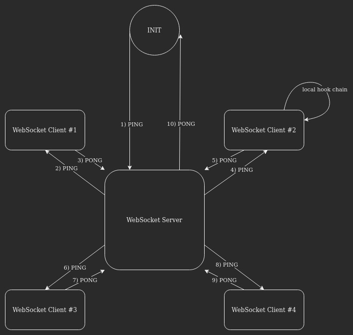
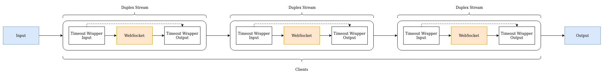

# WebSocket client chain

Creates a chain of all websocket connections.
This allow clients to modifie the the data that the server emits.

## Dataflow




## Example
```sh
node index.js
```

### Client #1
```js
const { Transform } = require("stream");
const WebSocket = require('ws');

const ws = new WebSocket('ws://127.0.0.1:8080');

const duplex = WebSocket.createWebSocketStream(ws);


const transform = new Transform({
    transform(chunk, encoding, cb) {

        chunk = chunk.toString();

        console.log("Possible modifiecation of", chunk);

        chunk = chunk.toUpperCase();

        this.push(chunk);

        cb();

    }
});


duplex.pipe(transform).pipe(duplex);
```

### Client #2
```js
const { Transform } = require("stream");
const WebSocket = require('ws');

const ws = new WebSocket('ws://127.0.0.1:8080');

const duplex = WebSocket.createWebSocketStream(ws);


const transform = new Transform({
    transform(chunk, encoding, cb) {

        chunk = chunk.toString();

        console.log("Possible modifiecation of", chunk);

        chunk = chunk.replace(/O/gi, "/");

        this.push(chunk);

        cb();

    }
});


duplex.pipe(transform).pipe(duplex);
```